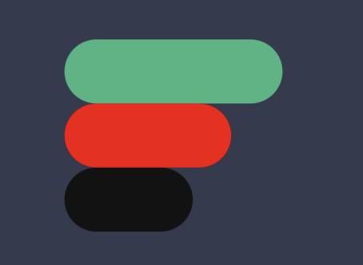

First, we need to compile the model with the inputs and outputs.

For this version, using 3 pieces, we have only 6 scenarios:

The inputs are an array of integers where 1 represents the lowest value and 3 represents the maximum value:

Inputs: [1, 2, 3], [1, 3, 2], [2, 1, 3], [2, 3, 1], [3, 1, 2], [3, 2, 1]

The outputs are an array with 2 values, where the first value is the object value and the second is the position to move the object:

Outputs: [0, 0], [3, 2], [2, 1], [1, 0], [3, 2], [1, 0]

Array positions: [0, 1, 2]

For a game with more pieces, use the permutation formula to preview the scenarios:

Scenarios = n!/(n-k)!
Scenarios that need some move = (n!/(n-k)!) - 1

# Compile 
To compile the model, go to model_game.py and run the file with your inputs and outputs. In the same directory, the model will be saved as a .keras file.

# Running the AI
To run the AI and preview the moves, you need to run game_api.py and type the pieces' positions with commas, like this: [3, 2, 1].

Where the game looks like this:

