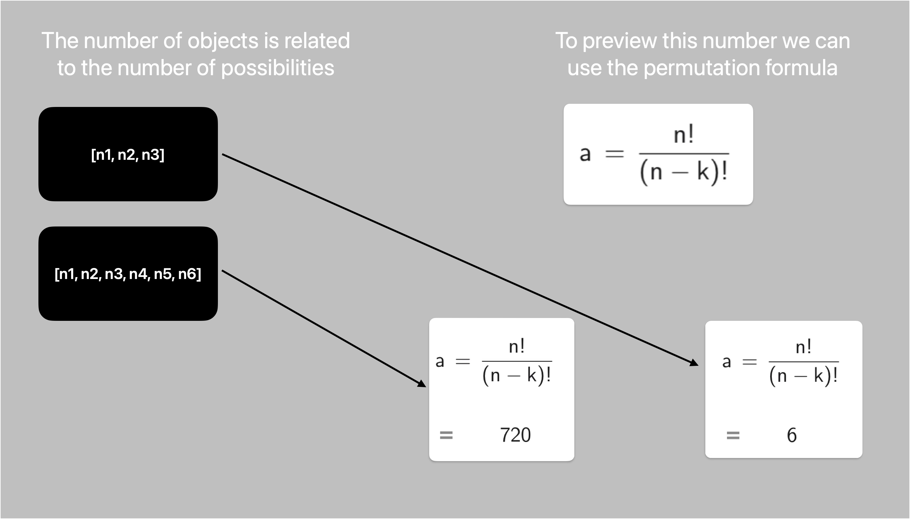

In this repository, we will create a simple game, an automation, and an AI to beat the game.

The game is a simple tower with n pieces, where the objective is to order the objects in ascending order.

To facilitate the training of the model, we will simplify the game to use only 3 pieces and reduce our inputs and outputs.

Next, we have an image explaining this.

